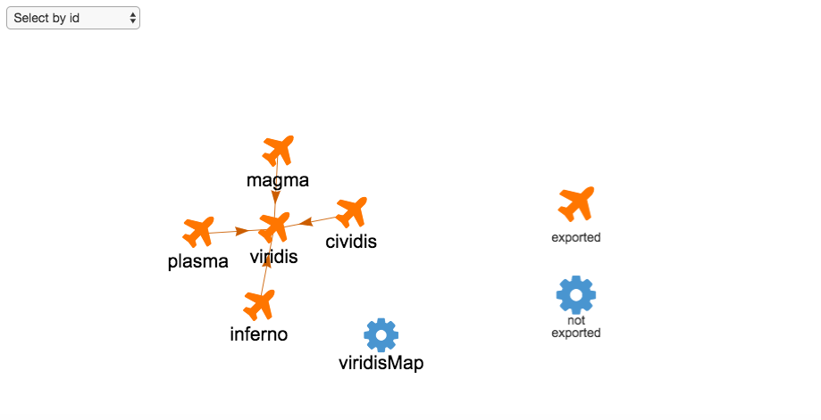

```{r funs-to-export, echo=FALSE}
# To export from pkginspector. E.g. ?readr::readr_example()
pkginspector_example <- function(path) {
  system.file(path, package = 'pkginspector')
}
```

```{r funs-helpers, echo=FALSE}
# Helpers for this rmarkdown document.
commas <- function(x) {
  if (length(x) == 1) return(x)
  
  n <- length(x)
  but_last <- x[1:(n - 1)]
  last <- x[n]
  
  butlast <- paste0(but_last, collapse = ", ")
  paste0(c(butlast, last), collapse = " and ")
} 

format_fun <- function(x) paste0("`", x, "()`")
```

# What's inside? __pkginspector__ provides helpful tools for inspecting package contents

[Sam Albers](https://github.com/boshek), [Leonardo Collado-Torres](https://github.com/lcolladotor), [Mauro Lepore](https://github.com/maurolepore), [Joyce Robbins](https://github.com/jtr13), [Noam Ross](https://github.com/noamross), [Omayma Said](https://github.com/OmaymaS)

<!--- Above is only for GitHub version, will be removed --->

The goal of __pkginspector__ is to help developers and reviewers better understand and evaluate the contents of R packages -- the building blocks that allow anyone to extend the R ecosystem. {TODO: Argue that it is important to ease the process for reviewing packages -- e.g. because reviews (a) are not compulsory; (b) done by volunteers with little time and varying expertise in software development; help improve the quality of the software that is ultimately used in research and decision-making.} For developers to build R packages that are easier to use and maintain, and for package-reviewers to better suggest improvements, we need to better understand the internal structure of R packages.

We begun building __pkginspector__ during [unconf18](TODO add link), with support from [rOpenSci](TODO add link) and guidance from [Noam Ross](TODO add link). The package focuses on facilitating a few of the many tasks involved in reviewing a package. (For more on rOpenSci's review process, see the blog post: ["Onboarding at rOpenSci: A Year in Reviews"](https://ropensci.org/blog/2016/03/28/software-review/) and the e-book [*rOpenSci Packages: Development, Maintenance, and Peer Review.*](https://ropensci.github.io/dev_guide/)) Specifically, we are building tools to analyze and visualize function dependencies, and to analyze function parameters within a package:

### Function calls

`rev_fn_summary()` helps you analyze function calls. It takes a package path and returns a table of information about its functions. Consider this example included in __pkginspector__:

```{r}
# devtools::install_github("ropenscilabs/pkginspector")
library(pkginspector)
path <- pkginspector_example("viridisLite")
rev_fn_summary(path)
```

```{r out-details, echo=FALSE}
out <- rev_fn_summary(path)
n <- 1:4
n_funs <- commas(format_fun(out$f_name[n]))
n_call <- commas(out$calls[n])
n_callby <- commas(out$called_by[n])
viridis <- out[out$f_name == "viridis", ]
```

The example shows that the number of functions called by `r n_funs` is `r n_call`, and that these functions are called by `r n_callby` functions. `viridis()`, in contrast, calls `r viridis$calls` functions but is called by `r viridis$called_by` functions. In this case, the number of `dependents` is `r viridis$dependents`. Dependents are counted recursively and include any functions in the calling chain. For example, if A calls B and B calls C, we would say that C is called by 1 (B) but has 2 dependents (A & B). `rev_fn_summary()` also provides information about function parameters in the `f_args` column.

*What's not working:* We know that we miss function calls if they are passed as parameters to `purrr::map()` and `do.call()` functions. There may be other systematic misses as well.

### Visualization

`vis_package()` helps you visualize the network of functions' dependencies ([interactive example](http://rpubs.com/jtr13/vis_package)).

```{r, eval = FALSE}
vis_package(path, physics = FALSE)
```

<!--- this link will be changed for the final draft per instructions --->


### Argument default usage

`rev_args()` identifies all the functions' arguments used in a given package. It returns a dataframe which main column, `detault_consistent` indicates whether or not the default value of the argument is consistent across the functions that use it. This helps to evaluate the complexity of the package and to identify potential sources of confusion, for example, if the meaning or default value of the same argument varies across functions.

```{r}
rev_args(path)$arg_df
```

The example shows that the parameter `n` is used inconsistently. [The documentation](https://github.com/sjmgarnier/viridisLite/blob/master/R/viridis.R) reveals that the default value of `n` is 256 in one function but missing in all others. This flags a potential issue that deserves further investigation.

### In sum

If you are building or reviewing an R package, __pkginspector__ can help you better understand its complex structure. This is an important step towards improving your code and research. While __pkginspector__ has room for improvement, the features built during and since unconf18 are already useful. We welcome your comments and feedback.
