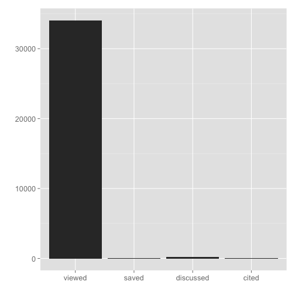
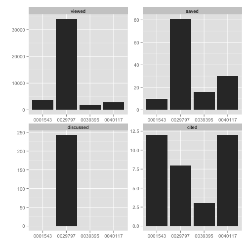
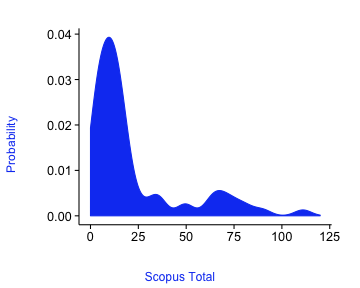
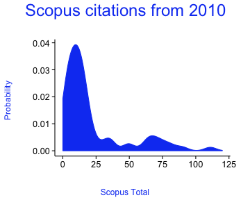
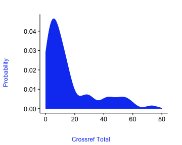
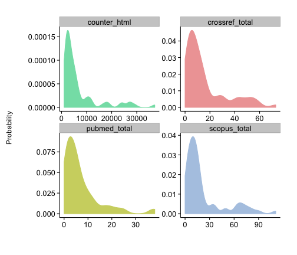

<!--
%\VignetteEngine{knitr::knitr}
%\VignetteIndexEntry{alm vignette}
-->


```
## Error in eval(expr, envir, enclos): object 'opts_chunk' not found
```

alm tutorial
============

## What are article level metrics? 

Glad you asked. The canonical URL for this is perhaps [altmetrics.org](http://altmetrics.org/manifesto/). Basically it is a metric that measures something about an article. This is in stark contrast to journal level metrics, like the Journal Impact Factor. 

## Are there other altmetrics data providers?

Yes indeedy. 

+ [ImpactStory](http://impactstory.it/)
+ [Altmetric.com](http://altmetric.com/)
+ [PlumAnalytics](http://www.plumanalytics.com/)

## Authentication

You are required to use an API key to access any Lagoota ALM API.

Get your API key for each service at:

* [PLOS](http://alm.plos.org/)
* [Crossref](http://det.labs.crossref.org/)
* [eLife](http://lagotto.svr.elifesciences.org/)
* [PKP](http://pkp-alm.lib.sfu.ca/)
* [Pensoft](http://alm.pensoft.net:81/)

Put your API key in your `.Rprofile` file using exactly this: 
options(PlosApiKey = "YOUalmAPIKEY"), 
and the functions within this package will be able to use your API key without you having to enter it every time you run a search. 

Or just pss in your key using the `key` parameter in function calls. Or keep your key as a system variable, named `ALM_KEY`. 

Of course you need a different key for each Lagotta instance (e.g., what works for PLOS does not work for Crossref). So just pass in your key with the `key` parameter. You can still store your keys in options, but just pass them on in the function call.

## Help 

If you are having trouble with this R package, contact [the maintainer, Scott](mailto:myrmecocystus@gmail.com). If you are having trouble with the API itself, there is a newish discussion forum for the Lagotto service at [http://discuss.lagotto.io/](http://discuss.lagotto.io/). 

## Install and load

Stable version from CRAN


```r
install.packages("alm")
```

Or development version from GitHub


```r
install.packages("devtools")
devtools::install_github("ropensci/alm")
```

Load `alm`


```r
library(alm)
```

## The default call with either doi, pmid, pmcid, or mdid without specifying an argument for info

(We'll not print a few columns so the table prints nicely)


```r
alm_ids(doi="10.1371/journal.pone.0029797")
```

```
## $meta
##   total total_pages page error
## 1     1           1    1    NA
## 
## $data
##                       .id  pdf  html readers comments likes  total
## 1               citeulike   NA    NA       1       NA    NA      1
## 2                crossref   NA    NA      NA       NA    NA      8
## 3                  nature   NA    NA      NA       NA    NA      4
## 4                  pubmed   NA    NA      NA       NA    NA      2
## 5                  scopus   NA    NA      NA       NA    NA      8
## 6                 counter 2524 30801      NA       NA    NA  33443
## 7        researchblogging   NA    NA      NA       NA    NA      1
## 8                     wos   NA    NA      NA       NA    NA      7
## 9                     pmc   78   534      NA       NA    NA    612
## 10               facebook   NA    NA     149       22    60    231
## 11               mendeley   NA    NA      80       NA    NA     80
## 12                twitter   NA    NA      NA       12    NA     12
## 13              wikipedia   NA    NA      NA       NA    NA     50
## 14          scienceseeker   NA    NA      NA       NA    NA      0
## 15         relativemetric   NA    NA      NA       NA    NA 157436
## 16                  f1000   NA    NA      NA       NA    NA      0
## 17               figshare    0    21      NA       NA     0     21
## 18              pmceurope   NA    NA      NA       NA    NA      4
## 19          pmceuropedata   NA    NA      NA       NA    NA     49
## 20            openedition   NA    NA      NA       NA    NA      0
## 21              wordpress   NA    NA      NA       NA    NA      0
## 22                 reddit   NA    NA      NA        0     0      0
## 23               datacite   NA    NA      NA       NA    NA      0
## 24             copernicus   NA    NA      NA       NA    NA      0
## 25        articlecoverage   NA    NA      NA        0    NA      0
## 26 articlecoveragecurated   NA    NA      NA        0    NA      0
## 27          plos_comments   NA    NA      NA       11    NA     16
```

## Details for a single DOI


```r
out <- alm_ids(doi='10.1371/journal.pone.0029797', info='detail')
```

info


```r
out$data$info
```

```
##                            doi
## 1 10.1371/journal.pone.0029797
##                                                                             title
## 1 Ecological Guild Evolution and the Discovery of the World's Smallest Vertebrate
##                                                                canonical_url
## 1 http://www.plosone.org/article/info%3Adoi%2F10.1371%2Fjournal.pone.0029797
##       pmid   pmcid                        mendeley_uuid
## 1 22253785 3256195 897fbbd6-5a23-3552-8077-97251b82c1e1
##            update_date     issued
## 1 2014-11-12T21:41:48Z 2012-01-11
```

sign posts


```r
out$data$signposts
```

```
##                            doi viewed saved discussed cited
## 1 10.1371/journal.pone.0029797  34055    81       243     8
```

totals


```r
out$data$totals
```

```
##                       .id  pdf  html readers comments likes  total
## 1               citeulike   NA    NA       1       NA    NA      1
## 2                crossref   NA    NA      NA       NA    NA      8
## 3                  nature   NA    NA      NA       NA    NA      4
## 4                  pubmed   NA    NA      NA       NA    NA      2
## 5                  scopus   NA    NA      NA       NA    NA      8
## 6                 counter 2524 30801      NA       NA    NA  33443
## 7        researchblogging   NA    NA      NA       NA    NA      1
## 8                     wos   NA    NA      NA       NA    NA      7
## 9                     pmc   78   534      NA       NA    NA    612
## 10               facebook   NA    NA     149       22    60    231
## 11               mendeley   NA    NA      80       NA    NA     80
## 12                twitter   NA    NA      NA       12    NA     12
## 13              wikipedia   NA    NA      NA       NA    NA     50
## 14          scienceseeker   NA    NA      NA       NA    NA      0
## 15         relativemetric   NA    NA      NA       NA    NA 157436
## 16                  f1000   NA    NA      NA       NA    NA      0
## 17               figshare    0    21      NA       NA     0     21
## 18              pmceurope   NA    NA      NA       NA    NA      4
## 19          pmceuropedata   NA    NA      NA       NA    NA     49
## 20            openedition   NA    NA      NA       NA    NA      0
## 21              wordpress   NA    NA      NA       NA    NA      0
## 22                 reddit   NA    NA      NA        0     0      0
## 23               datacite   NA    NA      NA       NA    NA      0
## 24             copernicus   NA    NA      NA       NA    NA      0
## 25        articlecoverage   NA    NA      NA        0    NA      0
## 26 articlecoveragecurated   NA    NA      NA        0    NA      0
## 27          plos_comments   NA    NA      NA       11    NA     16
```

history


```r
out$data$sum_metrics
```

```
##                .id year month day total X[[1L]]
## 1        citeulike 2012     1  12     1      NA
## 2           nature 2012     1  11     1      NA
## 3           nature 2012     1  12     1      NA
## 4           nature 2012     2   1     1      NA
## 5 researchblogging   NA    NA  NA    NA      NA
## 6    plos_comments 2012     1  11     1      NA
## 7    plos_comments 2012     1  12     7      NA
## 8    plos_comments 2012     1  13     1      NA
## 9    plos_comments 2012     1  14     1      NA
```

## Search using various identifiers, including pubmed id, pmc id, and mendeley id

A single PubMed ID (pmid)


```r
alm_ids(pmid=22590526)
```

```
## $meta
##   total total_pages page error
## 1     1           1    1    NA
## 
## $data
##                       .id  pdf  html readers comments likes total
## 1               citeulike   NA    NA       5       NA    NA     5
## 2                crossref   NA    NA      NA       NA    NA     5
## 3                  nature   NA    NA      NA       NA    NA     1
## 4                  pubmed   NA    NA      NA       NA    NA     5
## 5                  scopus   NA    NA      NA       NA    NA     9
## 6                 counter 1169 16238      NA       NA    NA 17455
## 7        researchblogging   NA    NA      NA       NA    NA     1
## 8                     wos   NA    NA      NA       NA    NA     7
## 9                     pmc   65   196      NA       NA    NA   261
## 10               facebook   NA    NA      72       57    56   185
## 11               mendeley   NA    NA      70       NA    NA    70
## 12                twitter   NA    NA      NA      161    NA   161
## 13              wikipedia   NA    NA      NA       NA    NA     0
## 14          scienceseeker   NA    NA      NA       NA    NA     0
## 15         relativemetric   NA    NA      NA       NA    NA 43647
## 16                  f1000   NA    NA      NA       NA    NA     0
## 17               figshare    0     0      NA       NA     0     0
## 18              pmceurope   NA    NA      NA       NA    NA     5
## 19          pmceuropedata   NA    NA      NA       NA    NA     0
## 20            openedition   NA    NA      NA       NA    NA     0
## 21              wordpress   NA    NA      NA       NA    NA     0
## 22                 reddit   NA    NA      NA        0     0     0
## 23               datacite   NA    NA      NA       NA    NA     0
## 24             copernicus   NA    NA      NA       NA    NA     0
## 25        articlecoverage   NA    NA      NA        0    NA     0
## 26 articlecoveragecurated   NA    NA      NA        0    NA     0
## 27          plos_comments   NA    NA      NA        3    NA     4
```

A single PubMed Central ID (pmcid)


```r
alm_ids(pmcid=212692)
```

```
## $meta
##   total total_pages page error
## 1     1           1    1    NA
## 
## $data
##                       .id  pdf  html readers comments likes   total
## 1               citeulike   NA    NA       8       NA    NA       8
## 2                crossref   NA    NA      NA       NA    NA     164
## 3                  nature   NA    NA      NA       NA    NA       0
## 4                  pubmed   NA    NA      NA       NA    NA     172
## 5                  scopus   NA    NA      NA       NA    NA     342
## 6                 counter 2701 21593      NA       NA    NA   24458
## 7        researchblogging   NA    NA      NA       NA    NA       0
## 8                     wos   NA    NA      NA       NA    NA     323
## 9                     pmc 2387  5119      NA       NA    NA    7506
## 10               facebook   NA    NA       0        0     0       0
## 11               mendeley   NA    NA     127       NA    NA     127
## 12                twitter   NA    NA      NA        0    NA       0
## 13              wikipedia   NA    NA      NA       NA    NA       0
## 14          scienceseeker   NA    NA      NA       NA    NA       0
## 15         relativemetric   NA    NA      NA       NA    NA 1570821
## 16                  f1000   NA    NA      NA       NA    NA       0
## 17               figshare    1    10      NA       NA     0      11
## 18              pmceurope   NA    NA      NA       NA    NA     212
## 19          pmceuropedata   NA    NA      NA       NA    NA      56
## 20            openedition   NA    NA      NA       NA    NA       0
## 21              wordpress   NA    NA      NA       NA    NA       0
## 22                 reddit   NA    NA      NA        0     0       0
## 23               datacite   NA    NA      NA       NA    NA       0
## 24             copernicus   NA    NA      NA       NA    NA       0
## 25        articlecoverage   NA    NA      NA        0    NA       0
## 26 articlecoveragecurated   NA    NA      NA        0    NA       0
## 27          plos_comments   NA    NA      NA        0    NA       0
```

## Search on many identifiers


```r
dois <- c('10.1371/journal.pone.0001543','10.1371/journal.pone.0040117',
	'10.1371/journal.pone.0029797','10.1371/journal.pone.0039395')
out <- alm_ids(doi=dois)
lapply(out$data, head)
```

```
## $`10.1371/journal.pone.0040117`
##         .id pdf html readers comments likes total
## 1 citeulike  NA   NA       0       NA    NA     0
## 2  crossref  NA   NA      NA       NA    NA     6
## 3    nature  NA   NA      NA       NA    NA     0
## 4    pubmed  NA   NA      NA       NA    NA     5
## 5    scopus  NA   NA      NA       NA    NA    12
## 6   counter 402 2055      NA       NA    NA  2482
## 
## $`10.1371/journal.pone.0039395`
##         .id pdf html readers comments likes total
## 1 citeulike  NA   NA       0       NA    NA     0
## 2  crossref  NA   NA      NA       NA    NA     1
## 3    nature  NA   NA      NA       NA    NA     0
## 4    pubmed  NA   NA      NA       NA    NA     1
## 5    scopus  NA   NA      NA       NA    NA     3
## 6   counter 240 1373      NA       NA    NA  1642
## 
## $`10.1371/journal.pone.0029797`
##         .id  pdf  html readers comments likes total
## 1 citeulike   NA    NA       1       NA    NA     1
## 2  crossref   NA    NA      NA       NA    NA     8
## 3    nature   NA    NA      NA       NA    NA     4
## 4    pubmed   NA    NA      NA       NA    NA     2
## 5    scopus   NA    NA      NA       NA    NA     8
## 6   counter 2524 30801      NA       NA    NA 33443
## 
## $`10.1371/journal.pone.0001543`
##         .id pdf html readers comments likes total
## 1 citeulike  NA   NA       0       NA    NA     0
## 2  crossref  NA   NA      NA       NA    NA     7
## 3    nature  NA   NA      NA       NA    NA     0
## 4    pubmed  NA   NA      NA       NA    NA     7
## 5    scopus  NA   NA      NA       NA    NA    12
## 6   counter 453 2742      NA       NA    NA  3243
```

## Get altmetrics by year

You can also get metrics by day (`sum_metrics='day'`) or month (`sum_metrics='month'`)


```r
alm_ids(doi='10.1371/journal.pone.0036240', sum_metrics='year')
```

```
## $meta
##   total total_pages page error
## 1     1           1    1    NA
## 
## $data
##               .id year total pdf  html
## 1       citeulike 2012     5  NA    NA
## 2        crossref 2014     5  NA    NA
## 3          nature 2012     1  NA    NA
## 4          pubmed 2014     5  NA    NA
## 5          scopus 2014     9  NA    NA
## 6         counter 2012    NA 699 10502
## 7         counter 2013    NA 299  3605
## 8         counter 2014    NA 171  2131
## 9             wos 2014     7  NA    NA
## 10            pmc 2012    NA  16    53
## 11            pmc 2013    NA  13    66
## 12            pmc 2014    NA  36    77
## 13       facebook 2014   185  NA    NA
## 14       mendeley 2014    70  NA    NA
## 15        twitter 2012   103  NA    NA
## 16        twitter 2013    33  NA    NA
## 17        twitter 2014    25  NA    NA
## 18 relativemetric 2014 43647  NA    NA
## 19      pmceurope 2014     5  NA    NA
## 20  plos_comments 2012     2  NA    NA
## 21  plos_comments 2014     1  NA    NA
```

## Output an-easy-to-combine-with-other-results data.frame


```r
alm_ids(doi='10.1371/journal.pone.0035869', total_details=TRUE)$data[,3:7]
```

```
##   citeulike_pdf citeulike_html citeulike_readers citeulike_comments
## 1            NA             NA                27                 NA
##   citeulike_likes
## 1              NA
```

## Get detailed data for altmetrics using `almevents`


```r
out <- alm_events(doi="10.1371/journal.pone.0029797")
names(out)
```

```
##  [1] "citeulike"        "crossref"         "nature"          
##  [4] "pubmed"           "scopus"           "counter"         
##  [7] "researchblogging" "pmc"              "facebook"        
## [10] "mendeley"         "twitter"          "wikipedia"       
## [13] "relativemetric"   "figshare"         "pmceuropedata"   
## [16] "plos_comments"
```

Get the results for PubMed Central


```r
# remove those with no data
out <- out[!out %in% c("sorry, no events content yet","parser not written yet")]
out[["pmc"]]
```

```
## $events_url
## [1] "http://www.ncbi.nlm.nih.gov/pmc/articles/PMC3256195"
## 
## $events
##    scanned.page.browse month cited.by abstract full.text unique.ip pdf
## 1                    0     1        0        1        51        42   8
## 2                    0     2        0        0        15        11   4
## 3                    0     3        0        0        11        12   4
## 4                    0     4        0        1         6         6   2
## 5                    0     5        0        0         5         5   1
## 6                    0     6        0        0         7         9   2
## 7                    0     7        0        1         6         8   3
## 8                    0     8        0        1         5         4   0
## 9                    0     9        0        0        14        13   5
## 10                   0    10        0        1        20        16   4
## 11                   0    12        0        0        13        12   1
## 12                   0     1        0        0        13        14   7
## 13                   0     3        0        1        22        20   2
## 14                   0     2        0        0        13        10   2
## 15                   0     4        1        1        45        24   4
## 16                   0    11        0        1        10         9   1
## 17                   0     5        0        0        18        21   5
## 18                   0     6        0        0        12        11   1
## 19                   0     7        0        0        27        14   1
## 20                   0     8        0        0        21        13   0
## 21                   0     9        0        0        14        13   0
## 22                   0    10        0        0        14        15   3
## 23                   0    11        0        6        18        16   2
## 24                   0    12        0        0        14         9   1
## 25                   0     1        0        0        22        16   1
## 26                   0     2        0        0        13        12   1
## 27                   0     3        0        0        11        10   1
## 28                   0     5        0        0        15        12   0
## 29                   0     6        0        0        12        12   2
## 30                   0     4        0        0         8         9   1
## 31                   0     8        0        0        18        14   3
## 32                   0     9        0        0        18        20   2
## 33                   0    10        0        0        23        18   4
##    year figure scanned.summary supp.data
## 1  2012      9               0         0
## 2  2012     11               0         2
## 3  2012      0               0         0
## 4  2012      0               0         0
## 5  2012      0               0         0
## 6  2012      2               0         0
## 7  2012      3               0         0
## 8  2012      0               0         0
## 9  2012      3               0         0
## 10 2012      1               0         0
## 11 2012      1               0         0
## 12 2013      0               0         0
## 13 2013      0               0         0
## 14 2013      0               0         0
## 15 2013      3               0         1
## 16 2012      0               0         0
## 17 2013      0               0         1
## 18 2013      0               0         1
## 19 2013      0               0         0
## 20 2013      0               0         0
## 21 2013      0               0         1
## 22 2013      2               0         0
## 23 2013      0               0         0
## 24 2013      0               0         0
## 25 2014      0               0         0
## 26 2014      0               0         0
## 27 2014      2               0         0
## 28 2014      0               0         1
## 29 2014      0               0         0
## 30 2014      0               0         1
## 31 2014      0               0         0
## 32 2014      0               0         0
## 33 2014      0               0         0
## 
## $csl
## list()
```

Get the results for twitter


```r
out$twitter$events[1:3,]
```

```
##                   id
## 1 237088032224849920
## 2 237088322290331648
## 3 263798980054487041
##                                                                                                                                    text
## 1                           #PLOS: Ecological Guild Evolution and the Discovery of the World's Smallest Vertebrate http://t.co/yEGLyWTf
## 2                           #PLOS: Ecological Guild Evolution and the Discovery of the World's Smallest Vertebrate http://t.co/497NRrMR
## 3 Happy #Halloween from Maria @PLOSONE, dressed as a tiny frog, complete with dime for scale! http://t.co/YWcdPoGP http://t.co/lAxWAHOG
##             created_at            user      user_name
## 1 2012-08-19T07:26:06Z        opdebult Jan ten Hoopen
## 2 2012-08-19T07:27:15Z      forestalis forestalis.org
## 3 2012-11-01T00:25:53Z multidiscipl1ne Lindsay Kelley
##                                                                                        user_profile_image
## 1                                          http://a0.twimg.com/profile_images/1741153180/Tidan_normal.jpg
## 2                                   http://a0.twimg.com/profile_images/654250700/ForestalisIco_normal.jpg
## 3 http://a0.twimg.com/profile_images/1910116023/261235_920680811178_6708085_43508969_7138379_n_normal.jpg
##                                                      event_url
## 1        http://twitter.com/opdebult/status/237088032224849920
## 2      http://twitter.com/forestalis/status/237088322290331648
## 3 http://twitter.com/multidiscipl1ne/status/263798980054487041
##             event_time
## 1 2012-08-19T07:26:06Z
## 2 2012-08-19T07:27:15Z
## 3 2012-11-01T00:25:53Z
```

## Retrieve and plot PLOS article-level metrics signposts.


```r
dat <- alm_signposts(doi="10.1371/journal.pone.0029797")
plot_signposts(input=dat)
```

```
## Using doi as id variables
```

 

Or plot many identifiers gives a line chart


```r
dois <- c('10.1371/journal.pone.0001543','10.1371/journal.pone.0040117','10.1371/journal.pone.0029797','10.1371/journal.pone.0039395')
dat <- alm_signposts(doi=dois)
plot_signposts(input=dat) + theme_grey(base_size = 12)
```

```
## Using doi as id variables
```

 

Or make an interactive chart by doing `plot_signposts(input=dat, type="multiBarChart")`. Try it out! It should open in your browser and you can interact with it.

## Density and histogram plots from PLOS Article Level Metrics data

Note: Do you the key below in the `searchplos` call in this example, but if you plan to use rplos more, get your own API key [here](http://api.plos.org/).


```r
library('rplos')
library('plyr')
dois <- searchplos(q='science', fl="id", fq=list('cross_published_journal_key:PLoSONE', 'doc_type:full', 'publication_date:[2010-01-01T00:00:00Z TO 2010-12-31T23:59:59Z]'), limit=75)
```

Remove non-full article DOIs


```r
dois <- dois$data$id
dois <- dois[!grepl("annotation", dois)]
```

Collect altmetrics data and combine to a `data.frame` with `ldply`


```r
alm <- alm_ids(doi=dois, total_details=TRUE)
alm <- ldply(alm$data)
```

The default plot


```r
plot_density(alm)
```

 

You can change the color of the density plot


```r
plot_density(alm, color="#EFA5A5")
```

 

Pass in a title or description subtending the title


```r
plot_density(alm, title="Scopus citations from 2010")
```

 

Plot a particular source


```r
plot_density(alm, source="crossref_total")
```

 

Plot many sources in different panels in the same plot, and pass in colors just for fun


```r
plot_density(input=alm, source=c("counter_html","crossref_total","pubmed_total","scopus_total"), color=c("#83DFB4","#EFA5A5","#CFD470","#B2C9E4")) + theme_grey(base_size = 12)
```

```
## No id variables; using all as measure variables
```

 

```
## NULL
```

## CrossRef article level metrics

Remember to get your api key from CrossRef, pass it in in the key parameter. Notice that we are passing the base url for the Crossref API, whereas the default is for the PLOS url [http://alm.plos.org/api/v3/articles](http://alm.plos.org/api/v3/articles).


```r
url <- "http://alm.labs.crossref.org/api/v5/articles"
dois <- c("10.1371/journal.pone.0086859", "10.1038/nature12990", "10.5860/choice.51-3037")
alm_ids(doi=dois, url = url, key=getOption("crossrefalmkey"))
```

```
## $meta
##   total total_pages page error
## 1     3           1    1    NA
## 
## $data
## $data$`10.1038/nature12990`
##              .id pdf html readers comments likes total
## 1       crossref  NA   NA      NA       NA    NA     0
## 2       mendeley  NA   NA      NA       NA    NA     0
## 3       facebook  NA   NA      NA       NA    NA     0
## 4            pmc  NA   NA      NA       NA    NA     0
## 5      citeulike  NA   NA      NA       NA    NA     0
## 6         pubmed  NA   NA      NA       NA    NA     0
## 7      wordpress  NA   NA      NA       NA    NA     0
## 8         reddit  NA   NA      NA       NA    NA     0
## 9      wikipedia  NA   NA      NA       NA    NA     6
## 10      datacite  NA   NA      NA       NA    NA     0
## 11     pmceurope  NA   NA      NA       NA    NA     0
## 12 pmceuropedata  NA   NA      NA       NA    NA     0
## 
## $data$`10.1371/journal.pone.0086859`
##              .id pdf html readers comments likes total
## 1       crossref  NA   NA      NA       NA    NA     0
## 2       mendeley  NA   NA      NA       NA    NA     0
## 3       facebook  NA   NA      NA       NA    NA     0
## 4            pmc  NA   NA      NA       NA    NA     0
## 5      citeulike  NA   NA      NA       NA    NA     0
## 6         pubmed  NA   NA      NA       NA    NA     0
## 7      wordpress  NA   NA      NA       NA    NA     0
## 8         reddit  NA   NA      NA       NA    NA     0
## 9      wikipedia  NA   NA      NA       NA    NA     2
## 10      datacite  NA   NA      NA       NA    NA     0
## 11     pmceurope  NA   NA      NA       NA    NA     0
## 12 pmceuropedata  NA   NA      NA       NA    NA     0
## 
## $data$`10.5860/choice.51-3037`
##              .id pdf html readers comments likes total
## 1       crossref  NA   NA      NA       NA    NA     0
## 2       mendeley  NA   NA      NA       NA    NA     0
## 3       facebook  NA   NA      NA       NA    NA     0
## 4            pmc  NA   NA      NA       NA    NA     0
## 5      citeulike  NA   NA      NA       NA    NA     0
## 6         pubmed  NA   NA      NA       NA    NA     0
## 7      wordpress  NA   NA      NA       NA    NA     0
## 8         reddit  NA   NA      NA       NA    NA     0
## 9      wikipedia  NA   NA      NA       NA    NA     0
## 10      datacite  NA   NA      NA       NA    NA     0
## 11     pmceurope  NA   NA      NA       NA    NA     0
## 12 pmceuropedata  NA   NA      NA       NA    NA     0
```
