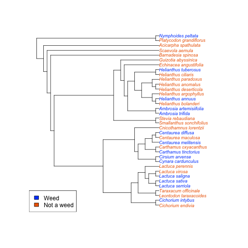

You can get invasive status for many species from various authorities via the Encyclopedia of Life (EOL). Here is a small example of how to do this. 

## Install and load taxize


```r
install.packages("taxize")
```


```r
library(taxize)
library(XML)
library(reshape2)
```


## Define a species list


```r
spplist <- c("Ambrosia artemisiifolia", "Cirsium arvense", "Centaurea melitensis", 
    "Centaurea diffusa", "Ambrosia trifida", "Helianthus annuus", "Carthamus oxyacanthus", 
    "Cnicothamnus lorentzii", "Stevia rebaudiana", "Cynara cardunculus", "Cichorium intybus", 
    "Smallanthus sonchifolius", "Cichorium endivia", "Acicarpha spathulata", 
    "Scaevola aemula", "Nymphoides peltata", "Platycodon grandiflorus", "Echinacea angustifolia", 
    "Guizotia abyssinica", "Helianthus tuberosus", "Helianthus argophyllus", 
    "Helianthus anomalus", "Helianthus bolanderi", "Helianthus ciliaris", "Helianthus deserticola", 
    "Helianthus paradoxus", "Leontodon taraxacoides", "Carthamus tinctorius", 
    "Centaurea maculosa", "Lactuca perennis", "Lactuca saligna", "Lactuca sativa", 
    "Lactuca serriola", "Lactuca virosa", "Taraxacum officinale", "Barnadesia spinosa")
```


## Search databases via EOL


```r
grisout <- eol_invasive(name = spplist, dataset = "gris")
gris <- do.call(rbind, grisout)

iscout <- eol_invasive(name = spplist, dataset = "isc")
isc <- do.call(rbind, iscout)

daisieout <- eol_invasive(name = spplist, dataset = "daisie")
daisie <- do.call(rbind, daisieout)

i3nout <- eol_invasive(name = spplist, dataset = "i3n")
i3n <- do.call(rbind, i3nout)

gisdout <- eol_invasive(name = spplist, dataset = "gisd")
gisd <- do.call(rbind, gisdout)
```


## Combine data sets


```r
df <- rbind(grisout, iscout, daisieout, i3nout, gisdout)[, -2]
dat <- dcast(df, searched_name ~ db, value.var = "eol_object_id")
dat <- ddply(dat, .(searched_name), transform, weedy = ifelse(length(na.omit(c(daisie, 
    gisd, gris, i3n, isc))) > 1, "#024DFD", "#ED6500"))
dat$searched_name <- gsub(" ", "_", dat$searched_name)
```


## Make the tree

Plain species tree


```r
tree <- phylomatic_tree(taxa = spplist, storedtree = "smith2011")
tree$tip.label <- taxize_capwords(tree$tip.label)
```


Order statustree by previous tip order of previous tree


```r
tiporder <- tree$tip.label
statustree <- dat[match(tiporder, dat$searched_name), ]
```


Plot colored and labeled tree


```r
plot(tree, cex = 0.75, tip.color = as.character(statustree$weedy), show.node.label = TRUE)
legend("bottomleft", legend = c("Weed", "Not a weed"), fill = c("#024DFD", "#ED6500"))
```

 

